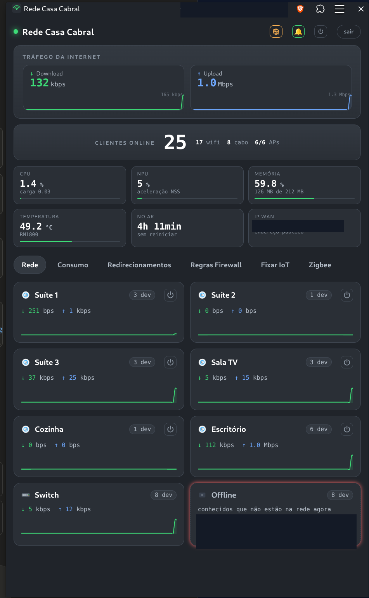

<p align="center">
  
</p>

<h1 align="center">WifiHub</h1>

<p align="center">
  <b>Uma rede Wi-Fi de verdade — mesh, roaming e VLANs — sem pagar o preço de um sistema fechado.</b><br>
  Painel de gerência e monitoramento para <b>OpenWrt</b>, direto dentro do <b>Home Assistant</b>.
</p>

<p align="center">
  
</p>

---

## 💡 Por que isso existe

Você quis montar um Wi-Fi bom em casa. Foi pesquisar, esbarrou em **Omada (TP-Link)**
e **UniFi (Ubiquiti)** — e levou um susto com o preço do ecossistema fechado:
controladora, access points caros, recursos que só aparecem no modelo de cima.

A real é que dá pra ter **a mesma qualidade** — cobertura, roaming, VLANs, firewall —
com **OpenWrt** e hardware comum, gastando **muito menos**. O que sempre pesou foi a
*gestão*: configurar tudo por linha de comando ou pular entre várias telas de LuCI,
uma por aparelho.

**É isso que o WifiHub resolve.** Ele junta o seu gateway e todos os seus APs OpenWrt
num **painel único e amigável**, com gráficos e controles, dentro do Home Assistant.

## 🎯 Para quem é

**Não é uma ferramenta para engenheiro de redes.** É para quem **quer uma boa rede
sem precisar virar especialista** — o entusiasta que topou montar com OpenWrt e quer
administrar tudo por uma tela simples, em vez de ficar dando SSH em cada aparelho.

## 💸 Quanto custa (exemplo real)

Dá pra montar uma rede de qualidade por uma fração de um sistema Omada/UniFi
equivalente:

| Item | Exemplo | Preço aprox. |
|---|---|---|
| **Gateway** | Acer Predator Connect W6x (rodando OpenWrt) | — |
| **Access points** | roteadores OpenWrt, cabeados | **< US$ 60 cada** |
| **Switch** | gerenciável (recomendado para VLANs) | — |

Um conjunto com gateway + 3–4 APs cabeados + um switch fica em **menos de US$ 450**.

> 💡 O segredo da qualidade é o **backhaul por cabo** entre os APs e, de preferência,
> um **switch gerenciável**. É o que garante roaming suave e VLANs bem separadas.

## ✨ O que você ganha

- 📶 **Fast roaming (802.11r)** — o celular troca de AP sem derrubar a ligação.
- 🔀 **VLANs** — separe IoT, convidados e a rede principal.
- 🌐 **Redirecionamento de portas** e regras de **firewall** por zona.
- 📊 **Gráficos de uso** ao vivo e histórico — por AP e por dispositivo.
- 👥 **Quem está em cada AP** — veja os clientes conectados em tempo real.
- 🎯 **Direcionamento de dispositivos** (AP steering) — útil para IoT teimoso.
- 🔌 **Reboot, temperatura, CPU/memória** do gateway num olhar.
- 🧩 Integrações extras (energia, Zigbee) no mesmo lugar.
- 🔒 Roda **na barra lateral do Home Assistant**, com a autenticação dele — **sem abrir porta na internet**.

## 🚀 Instalação

O WifiHub é um **add-on do Home Assistant** (não é instalado pelo HACS — add-ons têm
a loja própria do HA):

1. **Ajustes → Add-ons → Loja → ⋮ (canto superior direito) → Repositórios**
2. Cole a URL deste repositório e adicione.
3. Instale o add-on **WifiHub** e clique em **Iniciar**.
4. Abra o **WifiHub na barra lateral** e siga o assistente: informe o IP do gateway e
   dos APs, a senha do roteador, e ele **instala a chave de acesso sozinho** e detecta
   os rádios. Simples assim.

> O InfluxDB usado para os gráficos já vem **embutido** no add-on — nada para instalar
> à parte. Se você já tiver um InfluxDB 2.x, pode apontar para ele nas opções.

## 🧰 Requisitos

- **Home Assistant** com suporte a add-ons (HA OS / Supervised).
- Arquitetura **aarch64** ou **amd64** (Raspberry Pi 4/5 64-bit ou PC). 32-bit não é suportado.
- Gateway e APs rodando **OpenWrt**, de preferência com **backhaul por cabo**.

### Dependências nos aparelhos

Para listar os clientes por AP, os aparelhos precisam do pacote **`iw`** (e,
recomendado, **`iwinfo`**). O próprio assistente **detecta o que falta e instala para
você** via `opkg`. Manualmente seria:

```
# OpenWrt novo (24.10+): usa apk
apk add iw iwinfo nlbwmon

# OpenWrt antigo: usa opkg
opkg update && opkg install iw iwinfo nlbwmon
```

(`nlbwmon` é opcional, só para a aba de Consumo por dispositivo.)

## ⚠️ Uso interno

O WifiHub foi pensado para rodar **na sua rede interna**, acessado pela interface do
Home Assistant. **Não foi desenhado para exposição direta à internet** — não faça
port-forward dele no roteador.

## 📄 Licença

[Apache-2.0](LICENSE).
